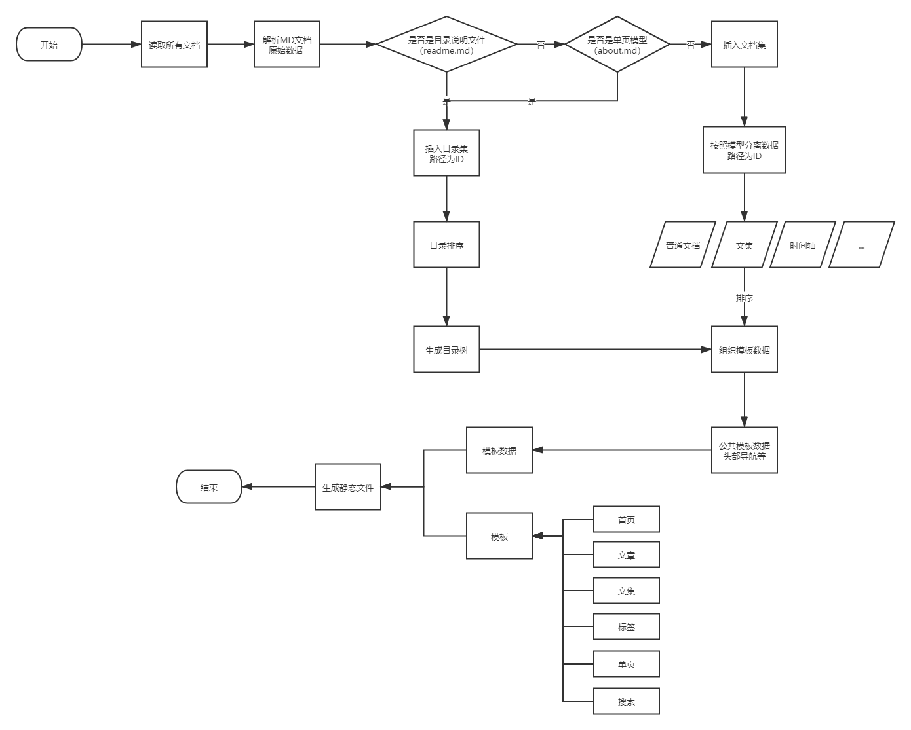

# markdown-to-html

使用gulp、markdown-it、Typescript等，读取本地markdown文档生成静态网站，支持tags和搜索功能。

## 如何使用这个系统

```shell
# 下载项目文件或者直接下载zip包解压（https://github.com/myestorm/markdown-to-html/archive/master.zip）
git clone https://github.com/myestorm/markdown-to-html.git

# 完成后进入项目目录
cd markdown-to-html

# 安装项目依赖包
npm install -d

# 生成静态网站
npm run build

# 启用本地http服务
npm run serve

# 浏览器访问 http://localhost:8080，即可查看生成后的站点
```

## 文档yaml配置说明

```shell
{
  mode: string, // [home, search, normal, single, tags, collection, timeline] // 默认：normal
  title: string, // 标题
  publishDate: string, // 2020-09-14 21:23:12
  order: number, // 数字，越小越靠前
  icon?: string, // 对目录说明文档有效
  keywords?: string[], // [黄花节的杂感, 鲁迅]
  desc?: string, // 描述
  recommend?: number, // 推荐位置 1:首页推荐 1：右侧文集 2：右侧文章
  cover?: string, // 封面
  timeline?: [] // 仅对mode = timeline 有效
}
```

[演示文档](./documents)

## 1.0.1版本更新

- [x] 增加配置字段
- [x] 内容页图片支持相册模式查看
- [x] 支持checkbox list
- [x] 支持本地视频和音频 `` ``
- [x] 非本站链接新窗口打开

更新文件列表(** 代表全部)：

- src/config/index.ts [注意：siteConfig增加字段copyrightText，其他未修改]
- src/lib/**
- src/models/**
- src/template/assets/**
- src/template/components/footer.html
- src/template/config.json

## 1.0.0版本更新

- [x] 更换了模板，能更好的兼容手机
- [x] 统一了Markdown的html样式
- [x] 采用了Typescript重构代码
- [x] 数据和模板完全分离，便于扩展mode
- [x] 拼音相同的可能会彼此覆盖，可以采用MD5来解决，只是觉得路径太难看，设置默认关闭了
- [x] 优化搜索JSON的大小
- [x] 增加public目录，以便放置一些装饰性图片
- [x] 时间轴以年划分文档
- [x] 精简配置文件
- [x] 其他

## 配置文件地址

src/config/index.ts
配置说明：

```typescript
export const siteConfig: SiteConfig = {
  hosts: '/', // 网址，必须以/结尾
  siteName: 'markdown-to-html', // 站点名称 将出现在页面title标签内
  siteRoot: 'www', // 站点根目录
  logo: '/img/logo_primary.png', // 标志
  logoTxt: 'Totonoo',
  logoSuffix: '.com',
  beian: '粤ICP备12041241号',
  favicon: '/favicon.ico',
  copyright: ['2005', new Date().getFullYear() + ''], // 底部copyright的年限
  copyrightText: 'Totonoo.com'
};

export const templateConfig: TemplateConfig = {
  root: './src/template',
  config: 'config.json',
  pageSize: 20 // 列表分页大小
};

export const docConfig: DocConfig = {
  root: 'documents', // 文档目录
  listDoc: 'readme.md' // 不能是中文
};
```

## 几点说明

- cover 可以是相对路径也可以是绝对路径，相对路径会自动转换，绝对路径不会处理。
- 图片的目录和文件名必须是英文字母，符号或数字。
- 如果同目录两个中文转出来的拼音是一致的会被覆盖。

## 演示站点

[https://www.totonoo.com](https://www.totonoo.com)

## 基本开发流程图



## 最后

开发这个原因是自己有一堆md文档笔记，想成弄一个网站，网上找了一圈，要么很难用懂，要么界面不喜欢，所以就自己动手了。其中有很多不足，但是“Done is better than perfect”。
